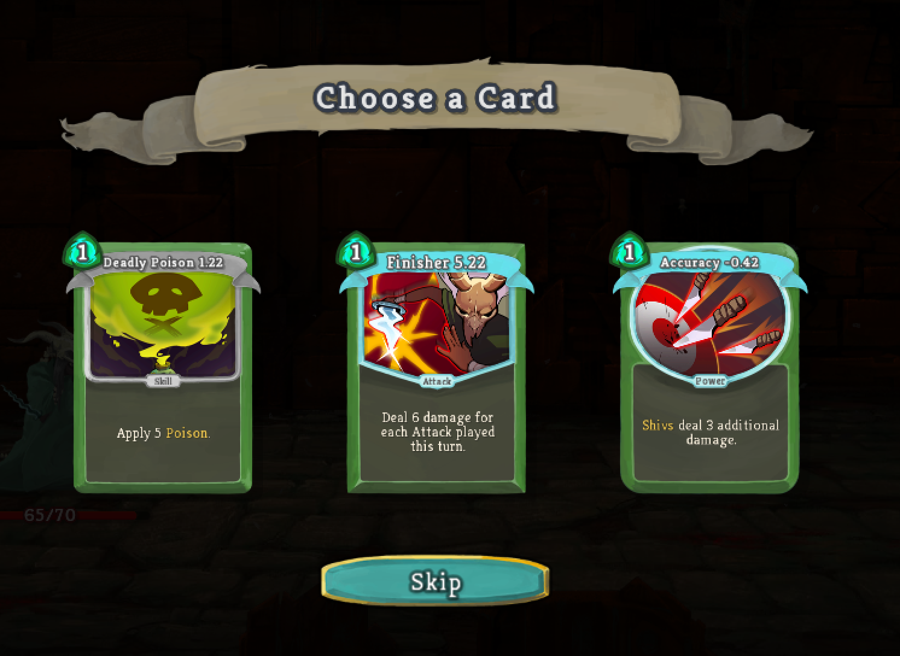
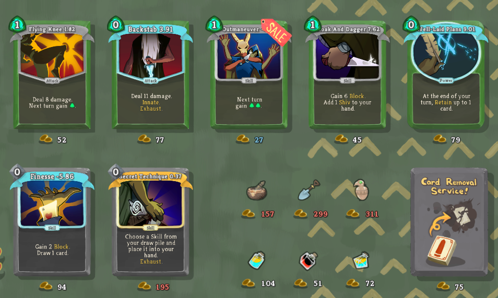

# STSDeckAssistant
A mod for Slay The Spire that helps you build a better deck.

## Requirements ##
#### General Use ####
* Java 8 (JRE). Currently only Java 8 should be used, issues with Java 9 are being looked into.
* BaseMod v.1.8.0+ (https://github.com/daviscook477/BaseMod/releases)
* ModTheSpire v2.3.0+ (https://github.com/kiooeht/ModTheSpire/releases)

## Installation ##
1. If you have `ModTheSpire` already installed you can skip to step 5. Otherwise continue with step 2:
2. Download `ModTheSpire.jar` from the latest release (https://github.com/kiooeht/ModTheSpire/releases)
3. Move `ModTheSpire.jar` into your **Slay The Spire** directory. This directory is likely to be found under `C:\Program Files (x86)\Steam\steamapps\common\SlayTheSpire`. Place `ModTheSpire.jar` in that directory so it looks like `C:\Program Files (x86)\Steam\steamapps\common\SlayTheSpire\ModTheSpire.jar`
4. Create a `mods` folder in your **Slay The Spire** directory so it looks like `C:\Program Files (x86)\Steam\steamapps\common\SlayTheSpire\mods`
5. Download `BaseMod.jar` from the latest release (https://github.com/daviscook477/BaseMod/releases)
6. Move `BaseMod.jar` into the `mods` folder you created in step 4
7. Download `FruityMod.jar` from the latest release (https://github.com/gskleres/FruityMod-StS/releases)
8. Move `FruityMod.jar` into the `mods` folder you created in step 4
9. Your modded version of **Slay The Spire** can now be launched by double-clicking on `ModTheSpire.jar`
10. This will open a mod select menu where you need to make sure that both `BaseMod` and `FruityMod` are checked before clicking **play**

Here is a great video showing how to install mods, by Xterminator: https://www.youtube.com/watch?v=r2m2aL1eEjw

## Special Thanks ##
1. Thanks to the [devs](https://www.megacrit.com/) of **SlayTheSpire** for making such and awesome game, allowing us to mod it, and allowing us to use recolored versions of their art assets in our mod
2. Thanks to t-larson and contributors (https://github.com/t-larson) for BaseMod!!
3. Thanks to kiooeht and contributors (https://github.com/kiooeht) for ModTheSpire!!
4. Thanks to FruityMod-StS contributors (https://github.com/gskleres/FruityMod-StS) for, among other things, this README that I ripped off
5. Thanks to /u/Alleji for SpireLogs (http://spirelogs.com)!

## Notes For Contributors ##

#### Development ####
* Java 8
* Maven
* CFR 124 (run this with Java 8, doesn't work well with 9)
* BaseMod v.1.7.0+
* ModTheSpire v2.2.1+
* ModTheSpireLib (whatever version is associated with your version of ModTheSpire)

### Building ##
1. Modify `pom.xml` to point to the location you've placed the dependencies
2. Copy `desktop-1.0.jar` from your Slay the Spire folder into `../_lib` relative to the repo.
3. Decompile `desktop-1.0.jar` with `java -jar "cfr_0_124.jar" --comments false --showversion false --caseinsensitivefs true --outputdir "decompiled" --jarfilter com.megacrit.cardcrawl.* "desktop-1.0.jar"`
4. Run `mvn package` to make the jar `STSDeckAssistant.jar` in the `targets` directory
